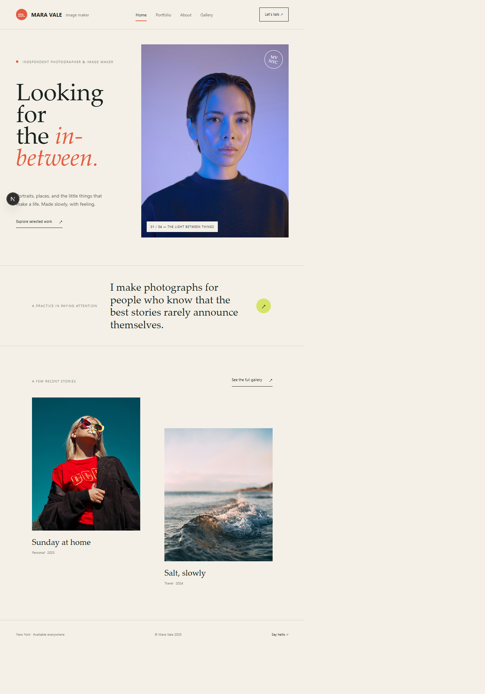
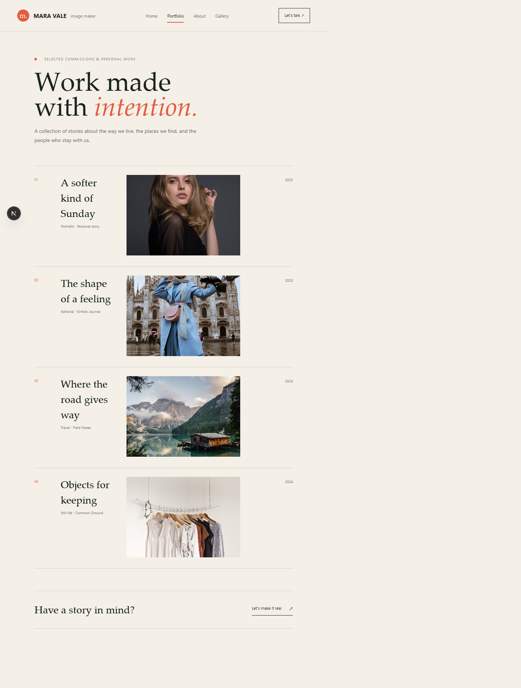
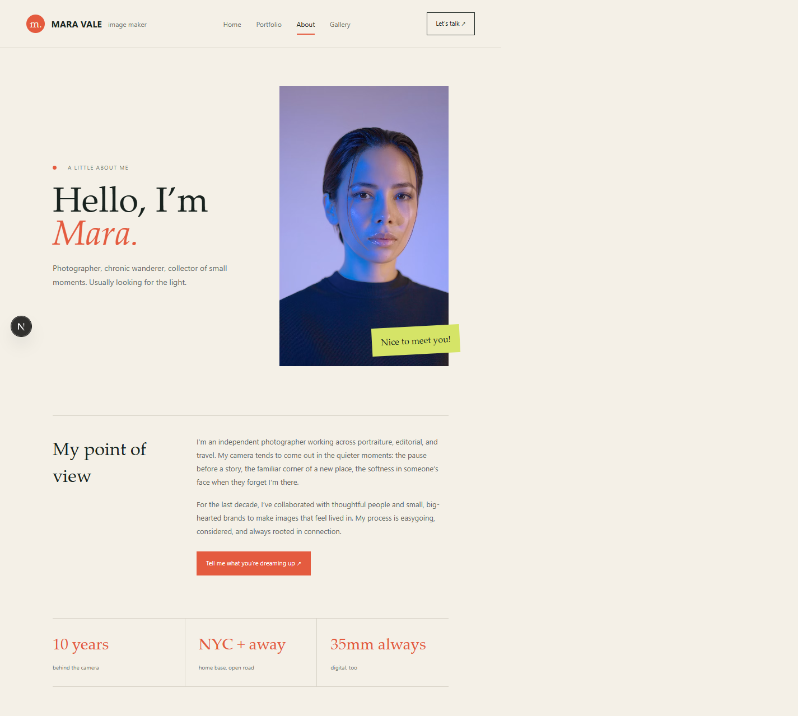
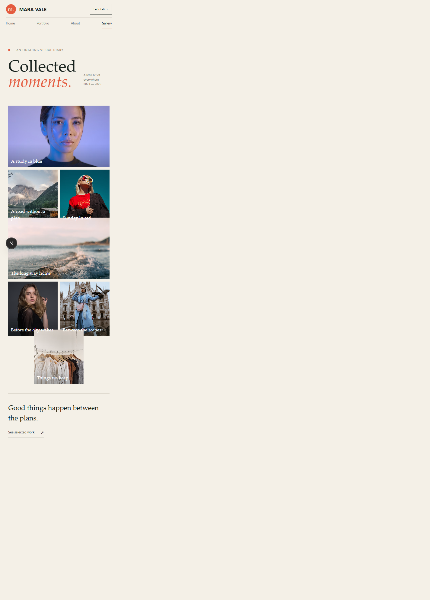

# Mara Vale — Photographer & Image Maker

A responsive four-page portfolio built with Next.js App Router, TypeScript, and Tailwind CSS. The shared header highlights the current route and supports keyboard navigation.

## Pages

- `/` — Home
- `/portfolio` — Selected projects
- `/about` — Studio biography and details
- `/gallery` — Visual diary

## Run locally

```bash
npm install
npm run dev
```

Open [http://localhost:3000](http://localhost:3000). Run `npm run lint` and `npm run build` to check the project.

## Screenshots







